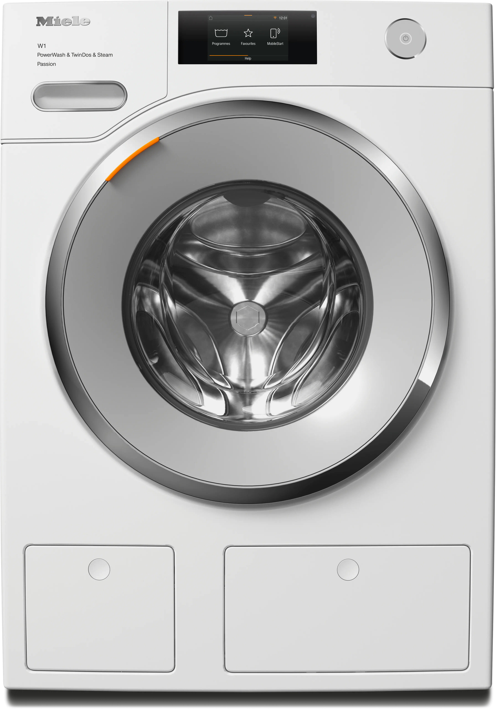

# 🧺 Miele W1 Interactive Card Generator for Home Assistant

🌐 **Русский** | [English](README_en.md)

Интерактивная карточка (Picture Elements) для стиральных машин Miele (специально для моделей серии W1 с TwinDos) и **встроенный HTML-генератор кода** для её быстрой настройки без необходимости вручную править YAML.

  

## 📸 Галерея

  

  
  &nbsp;&nbsp;
  
  &nbsp;&nbsp;
  

## ✨ Возможности

Вам больше не нужно копаться в десятках строк кода. Просто введите префикс вашей машинки в генератор, и он выдаст готовый YAML!

* ⭕ **Кольцо прогресса:** Динамическая LED-индикация вокруг люка, которая заполняется оранжевым цветом по мере выполнения программы стирки.
* 💧 **Динамический TwinDos:** Контейнеры Фазы 1 и Фазы 2 визуально заполняются и пустеют в реальном времени, в зависимости от процента остатка моющего средства.
* 🎛️ **Умное управление:** Контекстные кнопки Старт/Стоп (появляются только когда нужны) и кнопка Питания, меняющая цвет в зависимости от состояния машинки.
* 🔒 **Индикатор замка:** Наглядный статус дверцы (открыта/закрыта).
* ⚡ **Статистика:** Минималистичные показатели текущего расхода воды и электроэнергии.
* 🌍 **Мультиязычность:** Генератор и сама карточка поддерживают русский (Ru), английский (En) и немецкий (De) языки в один клик.

## ⚙️ Требования

Для работы CSS-градиентов (кольца прогресса и динамической заливки TwinDos) необходим плагин **card-mod**.
* Установите [lovelace-card-mod](https://github.com/thomasloven/lovelace-card-mod) через магазин **HACS** (раздел Frontend / Интерфейс).

## 🚀 Установка и использование

1. **Скачайте файлы**
   Скачайте файл генератора [miele_washer_card_generator.html](miele_washer_card_generator.html) и картинку без фона [washer.webp](washer.webp) из этого репозитория.

2. **Загрузите картинку в Home Assistant**
   * Перейдите в папку вашей конфигурации Home Assistant (там, где находится файл `configuration.yaml`).
   * Создайте (если еще нет) папку `www`, а внутри неё папку `miele`.
   * Поместите скачанный файл `washer.webp` по пути: `config/www/miele/washer.webp`.
   * **Перезагрузите Home Assistant.** После этого картинка станет доступна системе по локальному пути `/local/miele/washer.webp`.

3. **Сгенерируйте код**
   * Откройте скачанный файл `miele_washer_card_generator.html` в любом браузере на вашем компьютере. *(Если положить картинку `washer.webp` в ту же папку, генератор покажет красивое превью).*
   * Выберите нужный язык интерфейса.
   * Введите префикс сущности вашей стиральной машины. Например, если сенсор времени называется `sensor.stiralnaia_mashina_remaining_time`, ваш префикс — **stiralnaia_mashina**.
   * Нажмите **"Сгенерировать код"** и скопируйте результат.

4. **Добавьте на дашборд**
   * Зайдите в режим редактирования дашборда Home Assistant.
   * Нажмите "Добавить карточку" -> прокрутите вниз и выберите **Ручная (Manual)**.
   * Вставьте скопированный код и сохраните!

## 👨‍💻 Автор
Разработано [Eugen417](https://github.com/Eugen417) для интеграции стиральных машин Miele (PowerWash & TwinDos & Steam Passion) в Home Assistant.
